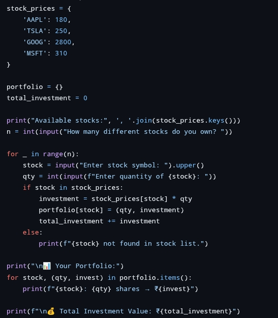

# Codealpha-task-2
Python domain 
# 🚀 CodeAlpha - Task 2 (Python Domain Internship)

Welcome to the repository for **Task 2** of my **CodeAlpha Virtual Internship** under the **Python Development** domain. This task helped me deepen my understanding of Python programming with practical implementation.

---

## 📂 Repository Structure

- `Task2.py` – Python script for Task 2 implementation
- `Screenshot_2025-07-29-17-31-34.jpg` – Output screenshot 1
- `Screenshot_2025-07-29-17-32-13.jpg` – Output screenshot 2

---

## 📌 Task 2 Details

| Field           | Description                                      |
|----------------|--------------------------------------------------|
| **Task Name**   | [Mention the exact task name, e.g., Number Guessing Game] |
| **Description** | [Write 1–2 lines on what the task does]         |
| **Status**      | ✅ Completed                                     |

---

## 🛠️ Technologies Used

- **Language:** Python 3.x
- **Tools:** VS Code, GitHub
- **Concepts:** [e.g., Loops, Conditionals, Random Module, etc.]

---

## 📸 Sample Output

| Screenshot | Description              |
|------------|--------------------------|
|  | Output of Task 2 (Part 1) |
|  | Output of Task 2 (Part 2) |

---

## 🙌 Special Thanks

Thanks to **CodeAlpha** for this opportunity and a chance to learn and showcase my Python skills through interesting tasks.

---

## 🔗 Connect with Me

- **GitHub:** [ARAVINDKUMARGS](https://github.com/ARAVINDKUMARGS)
- **LinkedIn:** [Aravind Kumar](https://www.linkedin.com/in/aravind-kumar)

---

> ⭐ Star this repo if you found it helpful or inspiring!
